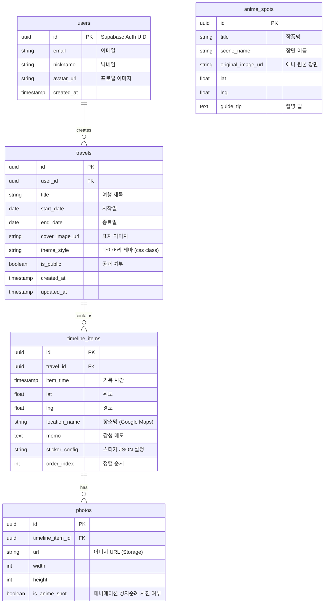

# Database Design: Travel Scrapbook

## Entity Relationship Diagram (ERD)

Supabase(PostgreSQL) 기반의 관계형 데이터베이스 스키마 설계입니다.

## 주요 테이블 설명

### 1. `users`
*   사용자 기본 정보. Supabase Auth의 `auth.users`와 연동하되, 앱 전용 프로필 정보(닉네임, 아바타)를 별도 관리.

### 2. `travels` (Travel Diary)
*   하나의 여행 프로젝트 단위. 책 한 권(Scrapbook)에 해당합니다.
*   `theme_style`: 다이어리의 전체적인 룩앤필(ex: `paper-v1`, `kraft-v2`)을 결정하는 식별자.

### 3. `timeline_items`
*   여행기 내의 개별 페이지 혹은 섹션.
*   `sticker_config`: 사용자가 배치한 스티커의 종류, 위치(x, y), 회전각도 등을 JSON 형태로 저장하여 로딩 시 렌더링.

### 4. `anime_spots`
*   관리자(개발자)가 미리 입력해두는 데이터. 사용자가 선택하여 '따라잡기' 기능을 수행할 기준 정보.
